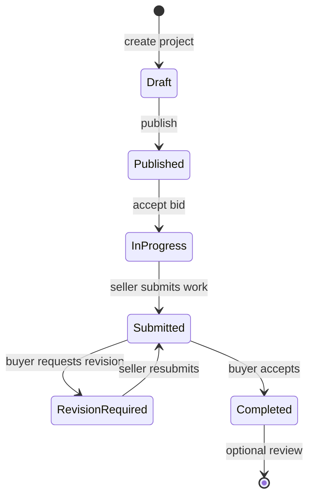

# HochuProect

Engineering freelance marketplace MVP — a monolithic ASP.NET Core application that connects buyers with technical freelancers through a structured project → bid → deal workflow. The system enforces domain rules (state machines, concurrency, participant checks) in code rather than in the UI, and ships with a closed-beta feature set: auth, deal lifecycle, chat, file deliverables, reviews, admin moderation, and in-app/email notifications — without real payment processing.

<div>
  

</div>

---

## Key features

- **Project marketplace** — create, publish, and browse engineering projects with categories, budgets, deadlines, and attachments
- **Bid workflow** — freelancers submit bids; buyers accept one bid, which atomically creates a deal and moves the project to `InProgress`
- **Deal lifecycle** — work submission with file uploads, buyer acceptance or revision requests, completion, and post-deal reviews
- **Deal-scoped chat** — messages tied to a deal conversation, with read receipts
- **Profiles & portfolio** — display names, bios, avatars, skills, and portfolio items with aggregated ratings from reviews
- **Services catalog** — secondary listing type (create, publish, archive); lighter UI coverage than projects
- **Notifications** — in-app notifications plus optional SMTP email on domain events (bid placed, work submitted, deal completed, etc.)
- **Admin moderation** — block/unblock users, hide/restore projects, inspect deals (`Admin` role)
- **Auth & account safety** — ASP.NET Identity cookie auth, email verification, password reset, terms/privacy acceptance, account blocking
- **File handling** — local filesystem storage with authorized download endpoints for deliverables and project attachments

---

## Tech stack

| Layer | Technology | Role |
|-------|------------|------|
| **Backend** | ASP.NET Core 8, Minimal API | HTTP API, middleware, hosting |
| **Architecture** | Vertical Slice | Feature folders (`Features/*`) with co-located endpoints, validators, and handlers |
| **Auth** | ASP.NET Core Identity | Cookie-based sessions, roles, email confirmation tokens |
| **Database** | PostgreSQL 16, EF Core 8 | Relational persistence, migrations, optimistic concurrency (`RowVersion`) |
| **Validation** | FluentValidation | Request validation registered from assembly |
| **Frontend** | Static HTML/CSS/JS (`wwwroot`) | SPA-style pages calling `/api/*`; no frontend build step |
| **API docs** | Swashbuckle | Swagger UI in Development |
| **Health** | AspNetCore.HealthChecks.NpgSql | `/health` endpoint |
| **Testing** | xUnit, FluentAssertions, WebApplicationFactory, Testcontainers | Unit + integration tests against PostgreSQL |
| **Infrastructure** | Docker, docker-compose, GitHub Actions | Local/prod containerization and CI |

---

## Architecture

Single deployable monolith. HTTP requests hit Minimal API endpoints grouped by feature. Endpoints validate input, resolve the current user from the cookie, and delegate to scoped **handlers** for multi-step operations (accept bid, submit work, fund deal). Simple reads/writes may use `AppDbContext` directly in the endpoint.

Rich **domain entities** (`Project`, `Bid`, `Deal`, …) encapsulate state transitions and raise **domain events**. After `SaveChangesAsync`, events are dispatched to `MarketplaceEventHandler`, which writes audit logs, in-app notifications, and optional emails — failures in notification/email paths are logged and do not roll back the business transaction.

```
┌─────────────┐     cookie auth      ┌──────────────────┐
│  wwwroot    │ ───────────────────► │  Minimal API     │
│  (HTML/JS)  │ ◄── JSON / files ─── │  Features/*      │
└─────────────┘                      └────────┬─────────┘
                                              │
                    ┌─────────────────────────┼─────────────────────────┐
                    ▼                         ▼                         ▼
             ┌─────────────┐           ┌─────────────┐           ┌─────────────┐
             │  Handlers   │           │  Domain     │           │  Infra      │
             │  (scoped)   │ ────────► │  entities   │           │  IFileStorage│
             └──────┬──────┘           │  + events   │           │  IEmailService│
                    │                  └─────────────┘           │  IPaymentService (stub)│
                    ▼                                            └─────────────┘
             ┌─────────────┐
             │ AppDbContext│ ──► PostgreSQL
             │ (EF Core)   │
             └─────────────┘
```

### Core marketplace flow (closed beta)

Payments are stubbed; accepting a bid creates a deal directly in `InProgress` with `FundedAt` set — no mandatory `/fund` step.



### Domain model (selected entities)

| Entity | Purpose |
|--------|---------|
| `ApplicationUser` / `Profile` | Identity user + public profile, skills, portfolio |
| `Project` / `ProjectAttachment` | Buyer job posting with lifecycle and files |
| `Bid` | Freelancer proposal; unique pending bid per seller per project |
| `Deal` / `DealDeliverable` / `DealDeliverableFile` | Contract between buyer and seller; work submissions |
| `Conversation` / `Message` | Per-deal chat |
| `Review` | Post-completion rating (one per author per deal) |
| `Notification` | In-app alerts |
| `Payment` | Payment record (stub provider only) |
| `AuditLog` | Append-only action log from domain events |
| `Service` | Alternative listing type (catalog API) |

### API surface

All JSON APIs live under `/api/*`. Feature groups:

| Prefix | Auth | Description |
|--------|------|-------------|
| `/api/auth` | Mixed | Register, login, logout, `/me`, email confirm, password reset |
| `/api/projects` | Mixed | CRUD-ish project ops, publish, cancel, attachments |
| `/api/bids` | Required | Place, list, withdraw, accept |
| `/api/deals` | Required | List, detail, fund (optional), submit, accept, request-revision, cancel |
| `/api/deals/{id}/messages` | Required | Chat |
| `/api/files` | Required | Download deliverable files and project attachments |
| `/api/profiles` | Mixed | Own profile, portfolio, avatar, public profile |
| `/api/reviews` | Mixed | Create review on completed deal; list profile reviews |
| `/api/notifications` | Required | List, mark read |
| `/api/categories` | Public | Category list |
| `/api/services` | Mixed | Service listings |
| `/api/admin` | Admin role | Users, projects, deals moderation |

Interactive API documentation: `/swagger` (Development only).

Errors use **RFC 7807 Problem Details** via `Result` → `ToProblemResult()` (`400`, `401`, `403`, `404`, `409`, `422`).

---

## Project structure

```text
HochuProectWebApp/
├── src/Web/
│   ├── Program.cs                 # Host, Identity, rate limiting, middleware pipeline
│   ├── Features/                  # Vertical slices (Auth, Projects, Bids, Deals, …)
│   ├── Domain/                    # Entities, enums, value objects, domain events
│   ├── Infrastructure/            # EF Core, email, files, payments stub, domain event dispatch
│   ├── Common/                    # Auth helpers, Result types, validation, endpoint registration
│   └── wwwroot/                   # Static UI (index, projects, deal, admin, auth pages, js/api.js)
├── tests/
│   ├── Web.UnitTests/             # Domain rules, validators (no database)
│   └── Web.IntegrationTests/    # Full HTTP flows against PostgreSQL
├── scripts/
│   ├── backup-postgres.sh
│   └── restore-postgres.sh
├── docker-compose.yml             # PostgreSQL + web app
├── Dockerfile
├── HochuProect.slnx
└── BETA_READINESS.md              # Detailed closed-beta audit and checklist
```

**Note:** `src/Web/Pages/` contains legacy Razor Pages that are **excluded from compilation** in `Web.csproj`. The active UI is entirely under `wwwroot/`.

---

## Getting started

### Requirements

- [.NET 8 SDK](https://dotnet.microsoft.com/download/dotnet/8.0)
- [Docker](https://www.docker.com/) (recommended) — for PostgreSQL and containerized runs
- For integration tests without Testcontainers: running PostgreSQL 16

### Quick start (Docker)

```bash
docker compose up --build
```

| URL | Description |
|-----|-------------|
| http://localhost:8080 | UI |
| http://localhost:8080/swagger | API docs (Development) |
| http://localhost:8080/health | Health check |

Docker Compose sets `Database__MigrateOnStartup=true`, applies EF migrations, seeds categories/roles, and mounts a persistent volume for uploaded files (`filesdata`).

### Local development (without full stack in Docker)

```bash
# Start PostgreSQL only
docker compose up db -d

# Run the app
cd src/Web
dotnet run
```

Default URLs from `launchSettings.json`: http://localhost:5121 (HTTP profile).

The app falls back to `Host=localhost;Port=5432;Database=hochuproect;Username=postgres;Password=postgres` when `ConnectionStrings__Default` is empty.

### Environment variables

Configuration follows ASP.NET Core conventions (`Section__Key`). Values in `appsettings.json` are empty or safe defaults; override via environment variables or user secrets.

| Variable | Description | Example |
|----------|-------------|---------|
| `ConnectionStrings__Default` | PostgreSQL connection string | `Host=db;Port=5432;Database=hochuproect;Username=postgres;Password=***` |
| `Database__MigrateOnStartup` | Apply EF migrations on startup | `true` |
| `FileStorage__Root` | Uploaded files directory | `/app/App_Data/files` |
| `FileStorage__MaxFileBytes` | Max upload size (bytes) | `20971520` |
| `App__PublicBaseUrl` | Base URL for links in emails | `https://app.example.com` |
| `Email__Enabled` | Use SMTP instead of log-only email | `true` |
| `Email__Host`, `Email__Port`, `Email__UseSsl`, `Email__User`, `Email__Password` | SMTP settings | — |
| `Email__FromAddress`, `Email__FromName` | Sender | — |
| `Admin__Email`, `Admin__Password` | Bootstrap admin user on startup | — |
| `Payment__Provider` | Payment backend (`Stub` only) | `Stub` |
| `ASPNETCORE_ENVIRONMENT` | `Development` / `Production` | `Development` |
| `ASPNETCORE_URLS` | Listen URLs | `http://+:8080` |

When `Email__Enabled=false`, `LoggingEmailService` writes email content to logs instead of sending.

In **Development**, new users get `EmailConfirmed=true` automatically; in **Production**, email confirmation is required before sensitive actions.

### Database

Migrations live in `src/Web/Infrastructure/Persistence/Migrations/`. Key migrations:

| Migration | Changes |
|-----------|---------|
| `20260812170423_InitialCreate` | Full schema |
| `20260828035400_BetaReadiness` | `IsBlocked`, terms timestamps, deal revision fields |

On startup (when migrate is enabled): migrations run, then `DbSeeder` (categories) and `RoleSeeder` (admin user). In Development, `DemoDataSeeder` adds sample data.

Manual migration:

```bash
cd src/Web
dotnet ef database update
```

---

## Development

Commands from the solution root:

```bash
# Restore dependencies
dotnet restore HochuProect.slnx

# Build
dotnet build HochuProect.slnx -c Release

# Run (from project directory)
cd src/Web && dotnet run

# Add EF migration (requires dotnet-ef tool)
cd src/Web
dotnet ef migrations add MigrationName
```

There is no separate lint/format script in the repository. Validation is enforced at build time via nullable reference types and at runtime via FluentValidation.

---

## Testing

| Project | Tests | Database |
|---------|-------|----------|
| `Web.UnitTests` | 12 | None — pure domain and validator tests |
| `Web.IntegrationTests` | 9 | PostgreSQL via Testcontainers, or external PG via env |

```bash
# All tests
dotnet test HochuProect.slnx

# Unit tests only (no PostgreSQL required)
dotnet test tests/Web.UnitTests

# Integration tests (Docker required for Testcontainers, unless PG is provided)
dotnet test tests/Web.IntegrationTests
```

Integration tests accept an external database via:

- `HOCHU_TEST_PG`, or
- `ConnectionStrings__Default`

CI sets `ConnectionStrings__Default` to a GitHub Actions PostgreSQL service (`hochuproect_test`).

**Coverage highlights:**

- Domain state machines (project publish, bid withdraw, deal beta flow with revision)
- Validators (registration terms, project title, bid cover letter)
- Integration: happy-path marketplace flow, concurrent bid accept (only one wins)
- Beta readiness: file download authorization, admin RBAC, password reset, terms enforcement

---

## Engineering decisions

**Vertical Slice Architecture** — Each feature (`Features/Projects`, `Features/Deals`, …) owns its endpoints and handlers. Endpoint classes implement `IEndpoint` and are discovered by assembly scan (`MapFeatureEndpoints`), avoiding a central route registry.

**Rich domain model** — Entities like `Deal` and `Project` enforce transitions (`SubmitWork`, `RequestRevision`, `RecordAcceptedBid`) and return `Result`/`Result<T>` instead of throwing for business rule violations. Domain events decouple side effects (notifications, audit) from core writes.

**Optimistic concurrency on hot paths** — `Project` and `Deal` use `RowVersion`. `AcceptBidHandler` uses a conditional SQL `UPDATE` on project status plus a transaction and unique indexes (`Deal.ProjectId`, `Deal.BidId`) to prevent double acceptance under concurrency (verified by `ConcurrentAcceptBid_OnlyOneSucceeds`).

**Result → HTTP mapping** — A single `AppError`/`ErrorKind` taxonomy maps to Problem Details status codes, keeping endpoints thin and responses consistent.

**Post-commit domain event dispatch** — `SaveAndDispatchAsync` persists first, then dispatches events. Notification/email failures are caught and logged in `MarketplaceEventHandler` so delivery problems do not fail the primary operation.

**Payment abstraction without production implementation** — `IPaymentService` / `StubPaymentService` remain in the codebase; beta flow skips mandatory funding. The `/fund` endpoint still exists for future integration.

**File storage abstraction** — `IFileStorage` with `LocalFileStorage` implementation; storage root configurable for Docker volumes. S3 is not wired.

**Cookie auth for same-origin SPA** — Identity application cookies with API-aware 401/403 (no redirect for `/api/*`). HttpOnly, SameSite=Lax, 14-day sliding expiration.

**Global rate limiting** — Fixed window: 180 requests/minute per IP (`429` on exceed).

---

## Trade-offs / design considerations

**Monolith over microservices** — Appropriate for MVP scope: one deployment unit, shared transactions for bid acceptance and deal creation, simpler local development. Service boundaries are expressed as vertical slices, not network boundaries.

**Static frontend over Razor/SPA framework** — Zero frontend build pipeline; pages in `wwwroot` call REST directly. Trade-off: no component reuse framework, manual DOM updates in `app.js`/`api.js`. Legacy Razor Pages were kept in the repo but removed from compilation.

**Beta without real payments** — Deals start in `InProgress` on bid accept to unblock closed beta (50–200 users per `BETA_READINESS.md`). Real escrow and payment release would require re-enabling the fund flow and a production `IPaymentService`.

**Polling-based chat** — Messages are REST endpoints, not SignalR/WebSockets. Simpler to operate; no real-time push.

**Local file storage** — Easy for Docker named volumes; not suitable for multi-instance deployments without shared storage or object store.

---

## Security

Mechanisms present in code:

- **Authentication** — ASP.NET Identity with password policy (8+ chars, upper/lower/digit), lockout after 5 failed attempts
- **Authorization** — Cookie sessions; `[RequireAuthorization]` on protected endpoints; `Admin` policy for `/api/admin/*`
- **Account guards** — `AccountGuards.RequireActiveUserAsync` checks blocked status and email confirmation
- **Input validation** — FluentValidation on requests; EF Core parameterized queries
- **File access** — Download endpoints verify deal/project participation before streaming
- **HTTP headers** — `X-Content-Type-Options: nosniff`, `X-Frame-Options: DENY`, `Referrer-Policy: strict-origin-when-cross-origin`
- **Rate limiting** — Global per-IP limiter
- **Secrets** — Empty credentials in committed `appsettings.json`; production values via environment variables
- **Legal consent** — Terms and privacy acceptance required at registration (stored timestamps on user)

Not implemented: CSRF tokens for API (same-site cookies mitigate somewhat), dedicated rate limits per endpoint, KYC, fraud detection.

---

## Deployment

### Docker

The `Dockerfile` publishes a Release build and listens on port `8080`. Pair with `docker-compose.yml` for PostgreSQL and file volume persistence.

TLS is expected to terminate at a reverse proxy (nginx, Caddy, Traefik). Set `App__PublicBaseUrl` to the public HTTPS URL for email links.

### PostgreSQL backups

```bash
export PGHOST=localhost PGPORT=5432 PGUSER=postgres PGDATABASE=hochuproect
./scripts/backup-postgres.sh ./backups
```

Restore:

```bash
./scripts/restore-postgres.sh ./backups/hochuproect_YYYYMMDDTHHMMSSZ.sql.gz
```

Stop the application before restoring.

### CI

GitHub Actions workflow `.github/workflows/ci.yml` runs on push/PR to `main`, `master`, and `VerticalSlice-migration`:

1. Checkout
2. Setup .NET 8
3. `dotnet restore HochuProect.slnx`
4. `dotnet build` (Release)
5. `dotnet test` with PostgreSQL 16 service container

---

## Roadmap

From project documentation (`BETA_READINESS.md`) — planned after closed beta, not yet implemented:

- Real SMTP deliverability tuning and production HTTPS/domain setup
- Automated backups and error monitoring (e.g. Sentry)
- Background job for buyer review reminders
- Remove or archive unused Razor Pages
- Rate limit tuning under real load

Explicitly **out of scope** for current MVP: real payments/escrow, KYC, anti-fraud, SignalR chat, mobile app, advanced search, arbitration, S3 storage, microservices.

See [BETA_READINESS.md](BETA_READINESS.md) for the full beta audit, API changelog, and UX checklist.

---

## Contributing

1. Fork and clone the repository
2. Run `docker compose up db -d` and `dotnet test HochuProect.slnx`
3. Create a feature branch from `main`
4. Keep changes within the relevant vertical slice (`Features/<Area>/`)
5. Add or update tests for domain rules and HTTP flows
6. Open a pull request — CI must pass (build + tests on PostgreSQL)
